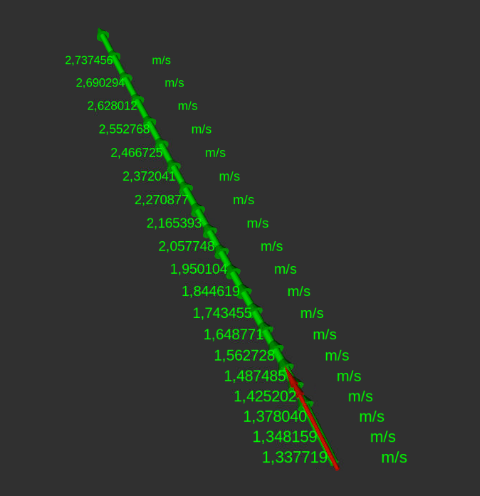

# RVIZ Visualization for a single Trajectory

Create rviz markers from trajectory points in trajectory message.

The visualization of every point in trajectory consists of the following:
* arrow  at the position of the trajectory point pointing in the direction of the orientation of the vehicle at that point.
* text marker showing the velocity of the vehicle expected at that point in the trajectory

## Example

Trajectory is shown in green along with odometry for a vehicle.